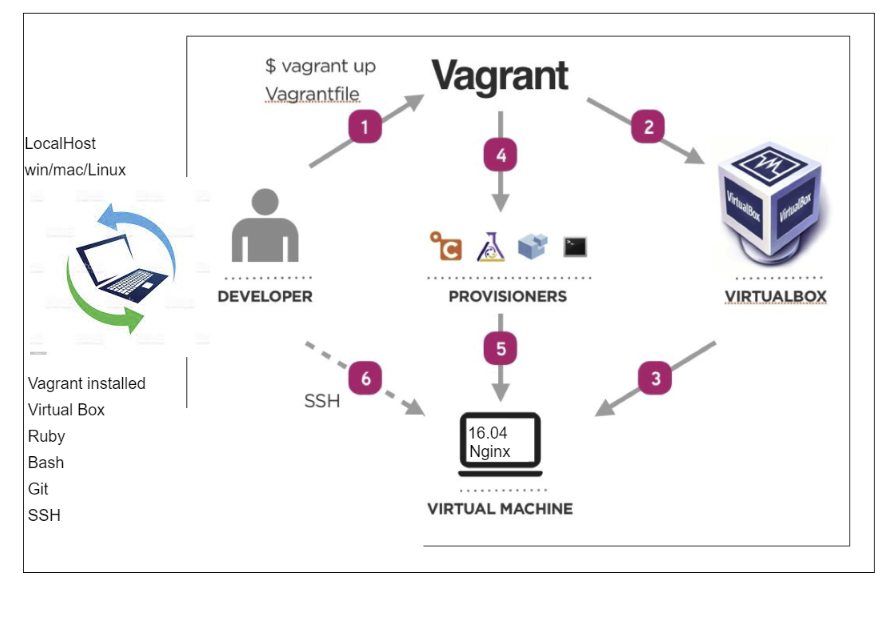

# Devops Intro
## **Life before Devops**
BEFORE DEVOPS, the model used for software development was the “WATERFALL” Model.
The waterfall model is a classical model used in system development life cycle to create a system with a linear and sequential approach.
Disadvantages of waterfall model:
- Makes changes difficult
- Excludes the client and/or end user:
As an internal process, the Waterfall methodology focuses very little on the end user or client involved with a project. Its main purpose has always been to help internal teams move more efficiently through the phases of a project.
- Delays testing until after completion
### **Why Devops**
DevOps is important because it's a software development and operations approach that enables faster development of new products and easier maintenance of existing deployments.
#### **Key Pillars of Devops**
- Easy to use
- Cost effective
- Flexible
- Robust
##### **Monolithic Architecture**
Its where all the code is composed in one piece. E.g. The front end, back end and the databases are written on a single file


### Development Environment

- **DevOps Introduction**
- DevOps is a culture that bridges the gap between Development and Operations
- This is done by creating an environmetn with all the updates and installations necessary to run the application
- The environment can be shared with other employees so that each one of them will have the same VM with the necessary installation requirements
- This overcomes the issue where the application was only working on a certain persons computer
-
- **Life before DevOps**
- Waterfall - V-model
- Transition to Agile methodology and SCRUM framework

- Create `Vagrrantfile` in the current location
```
Vagrant.configure("2") do |config|

 config.vm.box = "ubuntu/xenial64"
# creating a virtual machine ubuntu 

# assign private ip to our VM
 config.vm.network "private_network", ip: "192.168.10.100" 

 # Ensure to install hostsupdater plugin on our localhost before rerunning the vagrantfile
 config.hostsupdater.aliases = ["development.local"]

 # Sync folder from OS to VM
    # "." means current location - into/inside our VM -
 config.vm.synced_folder ".", "/home/vagrant/app"

 # Provide the type of provisioner like "shell, or file" you want to use.
 # If you chose 'file' then you have to provide the source of the file and where
 # you want to save the file on the guest VM.
 # If you chose 'shell' then just provide the path of the script which will run
 # all the installations automatically.
 #config.vm.provision "file", source: "./app/provision.sh", destination: "/home"
 
 config.vm.provision "shell", path: "./app/provision.sh"

end
```
- Create `provision.sh`
```
#!/bin/bash

# Updates system
sudo apt-get update -y

# Upgrades system
sudo apt-get upgrade -y

# Installs nginx server
sudo apt-get install nginx -y

# Opne nginx web server on 192.168.10.100
```
- Commands used today:
```
On the host machine:
- vagrant up (to run the Vagrantfile and create a VM using VB)
- vagrant status (the VM should be running after running vagrant with 'vagrant up')
- type the ip address on the host url bar to see if nginx is working e.g. 
192.168.10.100
- vagrant ssh (to check if the nginx is running which should be if the nginx website opened up)
- vagrant destroy (to destroy the vagrant VM)
- rm -rf .Vagrantfile (after you destroyed the vagrant VM)

try these commands inside of the guest VM:
- systemsctl status nginx (to check the status of the nginx server)
- sudo systemsctl start nginx (starts the nginx server manually)
- sudo systemsctl stop nginx (stops the nginx server manually)
```
- Vagrant commands:
```
Common commands:
     autocomplete    manages autocomplete installation on host
     box             manages boxes: installation, removal, etc.
     cloud           manages everything related to Vagrant Cloud
     destroy         stops and deletes all traces of the vagrant machine
     global-status   outputs status Vagrant environments for this user
     halt            stops the vagrant machine
     help            shows the help for a subcommand
     hostsupdater
     init            initializes a new Vagrant environment by creating a Vagrantfile
     login
     package         packages a running vagrant environment into a box
     plugin          manages plugins: install, uninstall, update, etc.
     port            displays information about guest port mappings
     powershell      connects to machine via powershell remoting
     provision       provisions the vagrant machine
     push            deploys code in this environment to a configured destination
     rdp             connects to machine via RDP
     reload          restarts vagrant machine, loads new Vagrantfile configuration
     resume          resume a suspended vagrant machine
     snapshot        manages snapshots: saving, restoring, etc.
     ssh             connects to machine via SSH
     ssh-config      outputs OpenSSH valid configuration to connect to the machine
     status          outputs status of the vagrant machine
     suspend         suspends the machine
     up              starts and provisions the vagrant environment
     upload          upload to machine via communicator
     validate        validates the Vagrantfile
     version         prints current and latest Vagrant version
     winrm           executes commands on a machine via WinRM
     winrm-config    outputs WinRM configuration to connect to the machine
```
- Testing the Environment to see we have all the necessary packages installed
```
- run 'vagrant up' in /starter-code
- cd into environment/spec-tests
- run these commands here:
gem install bundler
ruby --version
bundle
- next open a new bash terminal and ssh into it
- Run these commands in the VM:
sudo apt-get update -y
sudo apt-get upgrade -y
sudo apt-get install nginx -y
sudo apt-get install nodejs -y
sudo apt-get install python-software-properties
curl -sL https://deb.nodesource.com/setup_6.x | sudo -E bash -
sudo apt-get install nodejs
sudo npm install pm2 -g
- Next, cd into app/app
- Run these commands:
install npm
npm start
- Now you should be able to connect to the website on the port 3000. e.g.:
192.168.10.100:3000
http://192.168.10.100:3000/fibonacci/11
```